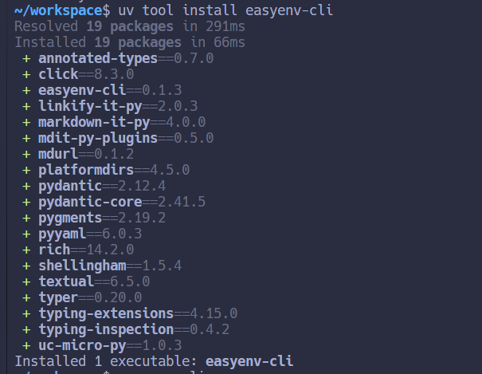
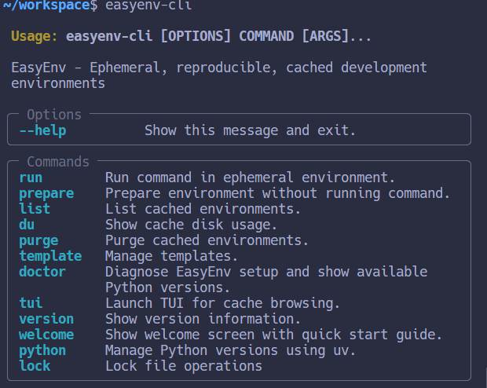
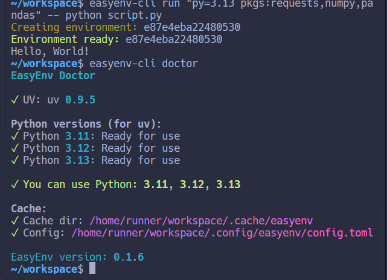
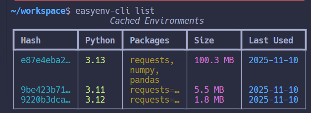
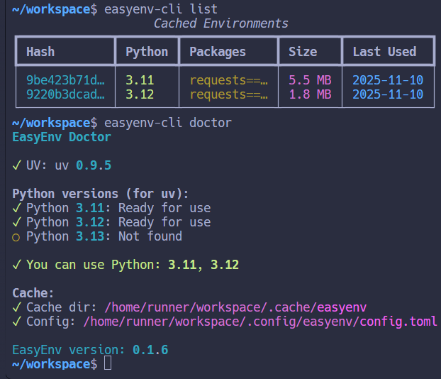
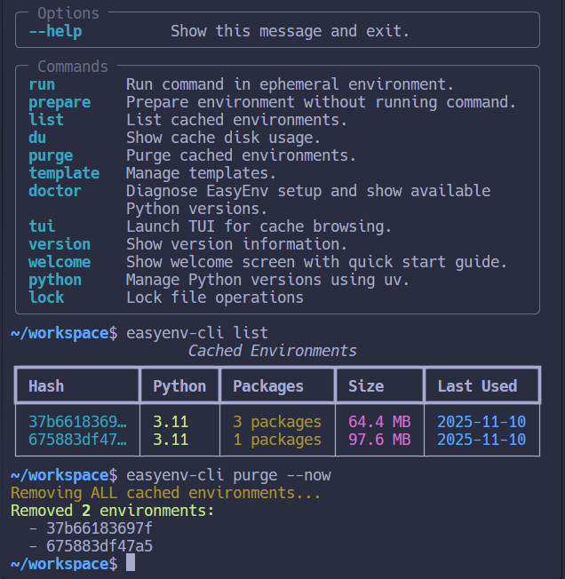
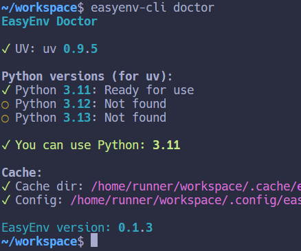

# EasyEnv CLI ⚡

<div align="center">

**Ephemeral, reproducible, cached development environments**

*One command → isolated environment → run your code → keep system clean*

[](https://pypi.org/project/easyenv-cli/)
[](https://pypi.org/project/easyenv-cli/)
[](https://opensource.org/licenses/MIT)

</div>

---

## 🎯 What is EasyEnv?

**EasyEnv CLI** is a command-line tool with terminal UI (TUI) that creates **ephemeral, reproducible, cached** Python development environments. 

**Core concept:** One command → ready isolated environment → execute user code → system stays clean with zero global pollution.

**Perfect for:**
- 🧪 Testing packages without global installation
- 🚀 CI/CD pipelines with fast, isolated builds  
- 📚 Teaching Python with consistent environments
- ⚡ Avoiding dependency conflicts across projects

**Powered by uv** for lightning-fast package installation.

## ✨ Key Features

- 🚀 **Instant ephemeral environments** - Create isolated Python environments on-demand
- 🔒 **Byte-for-byte reproducibility** - Lock files ensure exact environment replication
- 💾 **Smart caching** - Auto-reuse environments by hash, stored in `~/.easyenv/cache`
- 🧹 **Zero global pollution** - Everything isolated, never touches system Python
- ⚡ **uv-powered speed** - Lightning-fast package installations
- 🎯 **Simple DSL** - Human-readable specs: `py=3.12 pkgs:requests==2.32.3`
- 🖥️ **Interactive TUI** - Browse and manage cached environments visually
- 🐍 **Python version management** - Install and manage multiple Python versions
- 📋 **Templates** - Save and reuse environment specifications
- 🌐 **Offline mode** - Work without internet connection
- 📊 **SBOM generation** - Automatic software bill of materials



## 📑 Table of Contents

- [Why EasyEnv?](#-why-easyenv)
- [Features](#-features)
- [Installation](#-installation)
- [Quick Start](#quick-start)
- [Real-World Use Cases](#-real-world-use-cases)
- [DSL Syntax](#-dsl-syntax)
- [YAML Format](#yaml-format)
- [How It Works](#-how-it-works)
- [CI Integration](#-ci-integration)
- [Configuration](#️-configuration)
- [Advanced Usage](#-advanced-usage)
- [Comparison](#-comparison)
- [Roadmap](#️-roadmap)
- [Contributing](#-contributing)

## 🎯 Why EasyEnv?

Have you ever:
- 🤔 Needed to quickly test a package without installing it globally?
- 😤 Struggled with conflicting dependencies across projects?
- 🐌 Waited forever for Docker containers to build?
- 🧹 Wanted to keep your system Python clean and pristine?

**EasyEnv solves all of this!** Create isolated, cached environments in seconds, run your code, and keep your system clean. No Docker overhead, no global pollution, just pure speed and simplicity.

> **💡 Pro Tip:** EasyEnv is perfect for testing libraries, running CI/CD pipelines, teaching Python, and keeping your development environment pristine. Think of it as "Docker for Python, but faster and simpler!"

## ✨ Features

- 🚀 **Instant ephemeral environments** - Create isolated Python environments on-demand
- 🔒 **Reproducible builds** - Lock files ensure byte-for-byte reproducibility
- 💾 **Smart caching** - Reuse environments automatically with hash-based deduplication
- 🧹 **Zero global pollution** - Everything isolated in `~/.easyenv/cache`
- 📦 **Powered by uv** - Lightning-fast package installation
- 🎯 **Simple DSL** - Human-readable specs: `py=3.12 pkgs:requests==2.32.3`
- 📊 **SBOM generation** - Automatic software bill of materials
- 🖥️ **Optional TUI** - Browse and manage cached environments

## 📦 Installation

### Prerequisites

First, install [uv](https://github.com/astral-sh/uv) (if not already installed):

```bash
curl -LsSf https://astral.sh/uv/install.sh | sh
```

### Install EasyEnv

Choose your preferred method:

```bash
# Using pip
pip install easyenv-cli

# Using pipx (recommended for CLI tools)
pipx install easyenv-cli

# Using uv (fastest)
uv tool install easyenv-cli
```

### Verify Installation

```bash
# First run shows welcome screen with quick start guide
easyenv-cli

# Check your setup
easyenv-cli doctor
```

---

## ⚡ Getting Started in 30 Seconds

```bash
# 1. Install EasyEnv
uv tool install easyenv-cli

# 2. Run your first command in an isolated environment
easyenv-cli run "py=3.12 pkgs:requests" -- python -c "import requests; print('✅ It works!')"

# 3. That's it! The environment is cached and ready for reuse.
```

**What just happened?**
- ✅ Created an isolated Python 3.12 environment
- ✅ Installed the `requests` package
- ✅ Ran your code
- ✅ Cached everything for instant reuse
- ✅ Kept your system Python clean!

---

## Quick Start

**First time?** Run `easyenv-cli doctor` to check your setup, or `easyenv-cli welcome` to see the quick start guide.

### 🎯 Run command in ephemeral environment

```bash
# Basic usage
easyenv-cli run "py=3.12 pkgs:requests==2.32.3" -- python -c "import requests; print('✓')"

# Multiple packages
easyenv-cli run "py=3.11 pkgs:requests,numpy,pandas" -- python script.py

# With version constraints
easyenv-cli run "py=3.12 pkgs:requests==2.32.3,pendulum~=3.0" -- python app.py
```



### Prepare environment without running

```bash
# Pre-build for later use
easyenv-cli prepare "py=3.12 pkgs:ruff==0.7.2"
```

### Using YAML specs

Create `env.yaml`:

```yaml
python: "3.12"
packages:
  - "requests==2.32.3"
  - "pendulum~=3.0"
  - "numpy>=1.24.0"
scripts:
  post_install:
    - "python -c 'import requests; print(requests.__version__)'"
env:
  PANDAS_IGNORE_WARNING: "1"
  DEBUG: "true"
```

Run it:

```bash
easyenv-cli run env.yaml -- python my_script.py
```

### 📋 Templates

Save time with reusable environment templates!

```bash
# Save frequently-used specs as templates
easyenv-cli template add datasci "py=3.12 pkgs:numpy,pandas,matplotlib"
easyenv-cli template add testing "py=3.11 pkgs:pytest,coverage,ruff"
easyenv-cli template add webdev "py=3.12 pkgs:flask,requests,sqlalchemy"

# Use templates (so much easier!)
easyenv-cli use datasci -- jupyter lab
easyenv-cli use testing -- pytest tests/
easyenv-cli use webdev -- python app.py

# List all your templates
easyenv-cli template list
```

### 🗄️ Cache Management

Keep your cache clean and optimized!

```bash
# List all cached environments
easyenv-cli list

# Show disk usage (see what's taking up space)
easyenv-cli du

# Purge old environments (dry-run first!)
easyenv-cli purge --older-than 30d --dry-run
easyenv-cli purge --older-than 30d  # Actually delete

# Keep cache under size limit
easyenv-cli purge --max-size 8GB

# Remove environments older than a week
easyenv-cli purge --older-than 7d
```



### 🔒 Lock Files for Reproducibility

Ensure byte-for-byte reproducible environments across machines!

```bash
# Export lock file after running
easyenv-cli run "py=3.12 pkgs:requests" -- python -c "print('ok')"
easyenv-cli lock export abc123def456 -o production.lock.json

# Import lock file (reproduces EXACT environment)
easyenv-cli lock import production.lock.json

# Share lock files with your team for guaranteed consistency!
```



### 🐍 Python Version Management

EasyEnv can manage multiple Python versions for you!

```bash
# List installed Python versions
easyenv-cli python list

# Install Python 3.11
easyenv-cli python install 3.11

# Install Python 3.12
easyenv-cli python install 3.12

# Uninstall Python version
easyenv-cli python uninstall 3.12
```



### 🩺 Diagnostics

```bash
# Check your setup and configuration
easyenv-cli doctor
```

### 🖥️ TUI (Terminal UI)

Browse and manage your cached environments with an interactive terminal interface!

```bash
# Launch interactive cache browser
easyenv-cli tui
```



**TUI Features:**
- 📊 Visual overview of all cached environments
- 🔍 Search and filter environments
- 🗑️ Delete environments with a single keystroke
- 📈 Real-time disk usage statistics
- ⌨️ Keyboard-driven navigation

## 💡 Real-World Use Cases

### Quick Script Testing
```bash
# Test a script with specific dependencies without polluting your system
easyenv-cli run "py=3.12 pkgs:requests,beautifulsoup4" -- python scraper.py
```

### CI/CD Pipelines
```bash
# Run tests in isolated environments
easyenv-cli run "py=3.11 pkgs:pytest,coverage" -- pytest --cov=src tests/
```

### Data Science Experiments
```bash
# Try different library versions without conflicts
easyenv-cli run "py=3.12 pkgs:pandas==2.0.0,numpy==1.24.0" -- python analysis.py
easyenv-cli run "py=3.12 pkgs:pandas==2.1.0,numpy==1.25.0" -- python analysis.py
```

### Code Reviews
```bash
# Test someone's PR with their exact dependencies
easyenv-cli run requirements.yaml -- python their_feature.py
```

### Teaching & Workshops
```bash
# Students get identical environments instantly
easyenv-cli run "py=3.12 pkgs:jupyter,matplotlib,seaborn" -- jupyter lab
```

## 📖 DSL Syntax

The EasyEnv DSL is a simple, space-separated format:

```
py=<version> pkgs:<pkg1>,<pkg2> extras:<label1>,<label2> flags:<k=v>
```

### Components

- **`py=<version>`** (required) - Python version (e.g., `3.12`, `3.11`)
- **`pkgs:<packages>`** - Comma-separated package specs with version constraints
  - `requests==2.32.3` - Exact version
  - `numpy>=1.24.0` - Minimum version
  - `pandas~=2.0` - Compatible version
- **`extras:<labels>`** - Custom labels for grouping
- **`flags:<k=v>`** - Key-value flags for future extensions

### Examples

```bash
# Simple
py=3.12 pkgs:requests

# Multiple packages with versions
py=3.11 pkgs:requests==2.32.3,numpy>=1.24.0,pandas~=2.0

# With extras
py=3.12 pkgs:pytest,coverage extras:testing,ci

# Order doesn't matter
extras:dev pkgs:ruff py=3.12
```

## YAML Format

For complex environments, use YAML:

```yaml
python: "3.12"

packages:
  - "requests==2.32.3"
  - "numpy>=1.24.0"
  - "pandas~=2.0"

extras:
  - "dev"
  - "testing"

scripts:
  post_install:
    - "python -c 'import requests; print(requests.__version__)'"
    - "pytest --version"

env:
  DEBUG: "true"
  LOG_LEVEL: "info"
  CUSTOM_VAR: "value"

flags:
  optimize: "true"
```

## 🔧 How It Works

EasyEnv uses a smart caching system to make your development workflow blazing fast:

1. **Parse spec** - DSL or YAML → normalized specification
2. **Compute hash** - Stable hash from spec + platform + Python/UV versions
3. **Check cache** - Reuse if environment exists, otherwise create
4. **Create environment** - Use `uv` to create venv and install packages
5. **Run command** - Execute with PATH pointing to environment
6. **Keep clean** - No global modifications, all isolated in cache



### Cache Structure

```
~/.easyenv/cache/
├── index.db           # SQLite index
├── abc123def456/      # Environment (hash-based)
│   ├── bin/          # Virtual environment
│   ├── meta.json     # Metadata
│   ├── bom.json      # SBOM
│   └── spec.yaml     # Original spec
└── xyz789ghi012/
    └── ...
```

## 🔄 CI Integration

### GitHub Actions Example

Integrate EasyEnv into your CI/CD pipeline for fast, reproducible builds:

```yaml
name: Test with EasyEnv
on: [push, pull_request]

jobs:
  test:
    runs-on: ubuntu-latest
    steps:
      - uses: actions/checkout@v4

      - name: Install uv
        run: curl -LsSf https://astral.sh/uv/install.sh | sh

      - name: Install EasyEnv CLI
        run: pipx install easyenv-cli

      - name: Run tests
        run: |
          easyenv-cli run "py=3.12 pkgs:pytest,coverage" -- pytest -v

      - name: Lint
        run: |
          easyenv-cli run "py=3.12 pkgs:ruff" -- ruff check .
```

**Benefits in CI:**
- ⚡ Faster than Docker (no image building)
- 💾 Automatic caching between runs
- 🔒 Reproducible environments
- 🎯 No dependency conflicts

## ⚙️ Configuration

Customize EasyEnv to fit your workflow via `~/.config/easyenv/config.toml`:

```toml
# Custom cache directory
cache_dir = "/custom/path/to/cache"

# Default Python version
default_python = "3.12"

# Purge policies
purge_older_than_days = 30
purge_max_size_gb = 10.0

# Defaults
verbose = false
offline = false

# Templates
[templates]
datasci = "py=3.12 pkgs:numpy,pandas,matplotlib"
webdev = "py=3.11 pkgs:flask,requests"
```

## 🚀 Advanced Usage

### Offline Mode

Perfect for air-gapped environments or when you need to work without internet:

```bash
# Prepare environments first (while online)
easyenv-cli prepare "py=3.12 pkgs:requests"

# Use offline (no network access required)
easyenv-cli run "py=3.12 pkgs:requests" --offline -- python script.py
```

### Custom Index URLs

Use private PyPI mirrors or corporate package repositories:

```bash
# Use private PyPI mirror
export UV_INDEX_URL="https://pypi.company.com/simple"
easyenv-cli run "py=3.12 pkgs:internal-package" -- python script.py
```

### Verbose Output

Debug what's happening under the hood:

```bash
# See detailed logs
easyenv-cli run "py=3.12 pkgs:requests" -v -- python script.py
```

## 📊 Comparison

Why choose EasyEnv over other tools?

| Tool | Ephemeral | Cached | Reproducible | Speed | Global Install | Learning Curve |
|------|-----------|--------|--------------|-------|----------------|----------------|
| **EasyEnv CLI** | ✅ | ✅ | ✅ | ⚡ | ❌ | 🟢 Easy |
| venv | ❌ | ❌ | ⚠️ | 🐌 | ❌ | 🟢 Easy |
| Docker | ✅ | ✅ | ✅ | 🐌 | ⚠️ | 🟡 Medium |
| nix | ✅ | ✅ | ✅ | ⚡ | ⚠️ | 🔴 Steep |

**EasyEnv gives you the best of all worlds:** Docker-like isolation, nix-like speed, and venv-like simplicity!

## 🗺️ Roadmap

Exciting features coming soon:

- [ ] 🟢 **Node/Bun runtime support** - JavaScript/TypeScript environments
- [ ] 📚 **Template registry** - Share templates via git
- [ ] 🔄 **GitHub Actions cache integration** - Speed up CI/CD
- [ ] 🌐 **Web-based cache browser** - Manage environments from your browser
- [ ] 🐳 **Docker backend** - Optional containerization
- [ ] 🚀 **PowerToys Run / Flow Launcher integration** - Quick launcher support

## 📋 Requirements

- **Python 3.11+** - Modern Python version
- **[uv](https://github.com/astral-sh/uv)** - Fast Python package installer (auto-installed if missing)
- **OS**: Linux, macOS, or Windows (WSL recommended)

## 🛠️ Development

Want to contribute? Here's how to set up your development environment:

```bash
# Clone repository
git clone https://github.com/ruslanlap/EasyEnv.git
cd EasyEnv

# Install in development mode with dev dependencies
pip install -e ".[dev]"

# Run tests
pytest

# Type checking
mypy src/easyenv

# Linting
ruff check .

# Format code
ruff format .
```

## 📦 Releases

See [CHANGELOG.md](CHANGELOG.md) for release history and what's new in each version.

For maintainers: See [docs/RELEASE.md](docs/RELEASE.md) for release instructions.

### Installation Options

```bash
# Stable release (recommended)
pip install easyenv-cli

# Specific version
pip install easyenv-cli==0.1.0

# Using uv (fastest)
uv tool install easyenv-cli

# Latest from source (bleeding edge)
pip install git+https://github.com/ruslanlap/EasyEnv.git
```

## 📄 License

MIT License - see [LICENSE](LICENSE) file for details.

**TL;DR:** Free to use, modify, and distribute. No warranty provided.

## 🤝 Contributing

Contributions are welcome! Whether it's:

- 🐛 Bug reports
- 💡 Feature requests
- 📖 Documentation improvements
- 🔧 Code contributions

Please open an issue or PR on [GitHub](https://github.com/ruslanlap/EasyEnv).

## 🙏 Credits

Built with amazing open-source tools:

- **[uv](https://github.com/astral-sh/uv)** - ⚡ Blazingly fast Python package installer
- **[Typer](https://typer.tiangolo.com/)** - 🎯 Modern CLI framework
- **[Textual](https://textual.textualize.io/)** - 🖥️ Beautiful TUI framework
- **[Pydantic](https://docs.pydantic.dev/)** - ✅ Data validation and settings

---

<div align="center">

### **EasyEnv CLI** 🚀

*One command, ready environment, clean system.*

**[Install Now](#-installation)** • **[Quick Start](#quick-start)** • **[Documentation](#-dsl-syntax)** • **[GitHub](https://github.com/ruslanlap/EasyEnv)**

Made with ❤️ by the EasyEnv community

</div>
